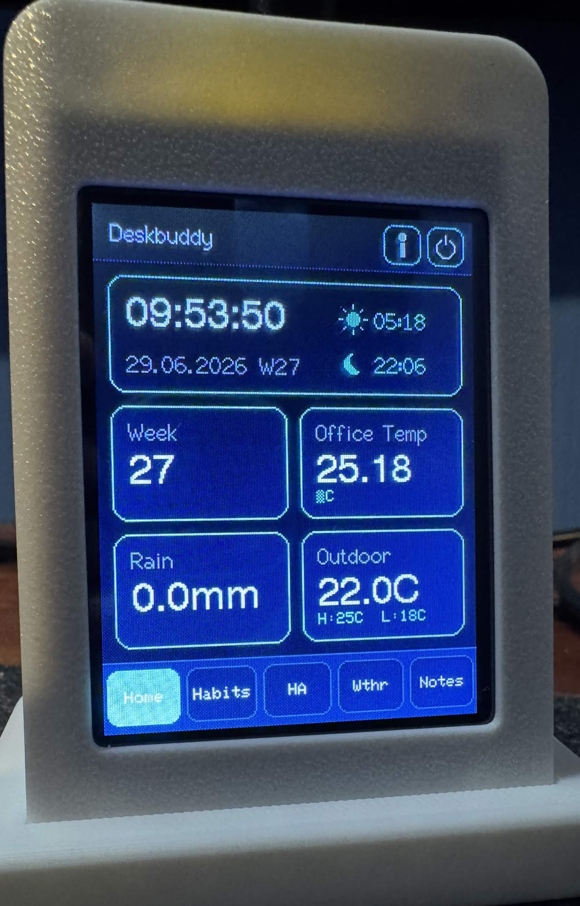
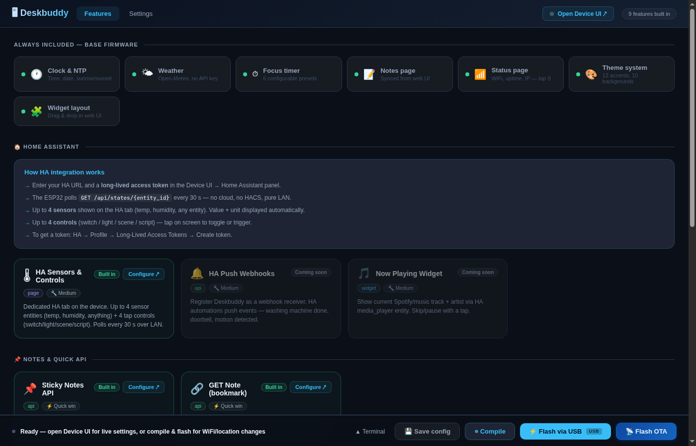
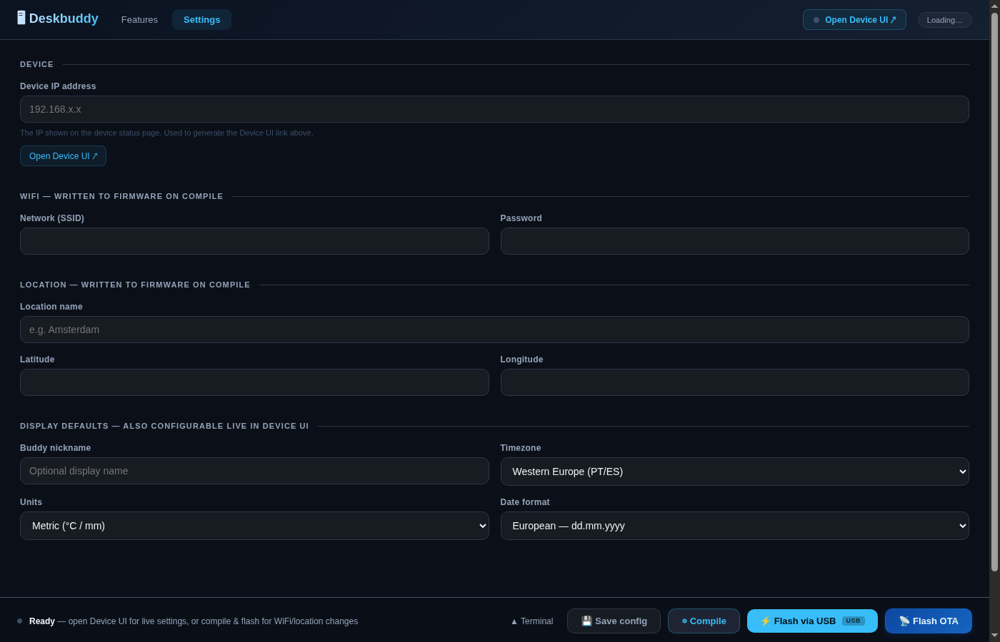
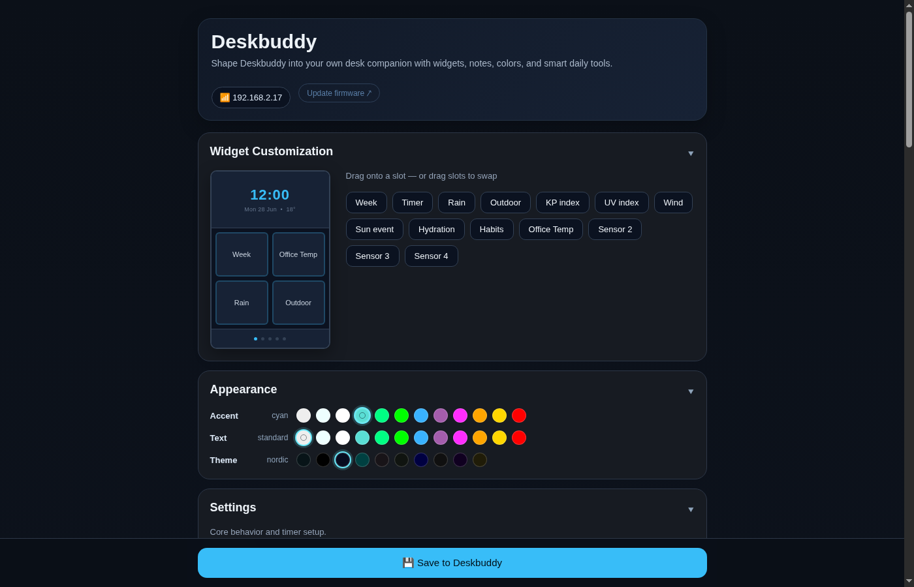
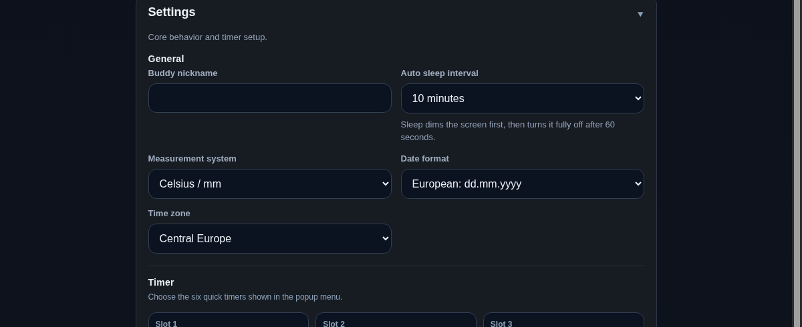

<div align="center">



# DeskBuddy

A compact ESP32 desk companion with a touchscreen display, live weather, Home Assistant integration, habit tracking, a focus timer, and a browser-based configurator. Built for the **ESP32-2432S028** ("Cheap Yellow Display").

[Features](#features) · [Getting started](#getting-started) · [Device web UI](#device-web-ui) · [Hardware](#hardware) · [Credits](#credits)

</div>

## Features

### Pages

| Page | What it shows |
|------|---------------|
| **Home** | Clock, week number, context clock, sunrise/sunset, and 4 configurable widgets |
| **Weather** | Temperature range, rain, wind, UV index, KP index, sun event |
| **Habits** | Daily habit tracker with 6 habits, streaks, and tap-to-check |
| **Home Assistant** | Live values from up to 4 HA sensor entities |
| **Notes** | Sticky note pushed via REST API from any device on your network |
| **Status** | Device IP, WiFi signal, uptime, and display controls |

### Home widgets

Choose any 4 of these to show on your home screen:

| Widget | Description |
|--------|-------------|
| Week number | Current ISO week |
| Focus timer | Configurable countdown with presets |
| Outdoor temp | Current temperature + daily range |
| Rain | Precipitation forecast |
| Wind | Speed and compass direction |
| UV index | Low / Moderate / High / Very High / Extreme |
| KP index | Geomagnetic activity level |
| Sun event | Next sunrise or sunset, auto-switching |
| Hydration | Water intake counter, resets at midnight |
| Habits | Mini habit completion summary |
| HA Sensors 1–4 | Any Home Assistant sensor value with unit |

### Themes

**Backgrounds:** Slate · Deep · Nordic · Forest · Coffee · Soft · Midnight · Graphite · Garnet · Ochre

**Accents:** Standard · Cyan · Ice · White · Mint · Green · Blue · Purple · Pink · Orange · Amber · Red

All theme changes apply instantly via the browser UI — no reflashing needed.

### More

- **Context clock** — show a second timezone on the clock card (great for remote teams)
- **Eye break reminders** — 20-20-20 rule overlay every N minutes, auto-dismisses after 20 seconds
- **Movement reminders** — "Time to move!" overlay every N minutes, tap to dismiss
- **Auto-dimming** — sleep modes with touch-to-wake; configurable dim and off intervals
- **NTP time sync** — timezone selection (UTC–UTC+12) with DST support for Europe, US, AU and more
- **Metric / imperial** — switch units and date format without reflashing
- **Nickname** — per-device label shown in the browser title bar
- **OTA updates** — flash new firmware over WiFi from the browser, no USB after initial setup

---

## Getting started

See [SETUP_GUIDE.md](SETUP_GUIDE.md) for the full walkthrough. Quick version:

```bash
# 1. Clone
git clone https://github.com/RolfKoenders/Deskbuddy.git
cd Deskbuddy

# 2. Create your secrets file
cp include/secrets.h.example include/secrets.h
# Edit secrets.h — add WiFi credentials and your city's coordinates

# 3. Flash over USB
pio run --target upload

# 4. Open the device web UI
# Check serial monitor for the IP, then open it in a browser
```

Or use the **Python configurator** (`python configurator.py`) for a browser-based build, flash, and OTA tool. After the initial USB flash, future updates can be pushed wirelessly.

<div align="center">


</div>

---

## Flashing

| Method | When to use |
|--------|-------------|
| `pio run --target upload` (USB) | Initial setup, or after changing `secrets.h` |
| Configurator "Flash via USB" (USB) | Same as above, with a browser UI |
| Configurator "Flash OTA" (WiFi) | After initial setup — no USB cable needed |

You can also upload a `.bin` manually at `http://<device-ip>/update`.

---

## Device web UI

Open the device's IP address in any browser to change settings live — no reflash required:

- Widget layout (drag and drop which 4 widgets appear on the home screen)
- Theme — background, accent color, text color
- Context clock — second timezone + short label
- Location name, latitude, longitude
- Timezone, units, date format
- Focus timer presets
- Eye break and movement reminder intervals
- Buddy nickname
- Sleep / dim behavior
- Home Assistant connection and sensor entity IDs

<div align="center">


</div>

---

## Sticky Notes API

Push a note to the device from anywhere on your network:

```bash
# Set a note
curl -X POST http://<device-ip>/api/note \
  -H "Content-Type: application/json" \
  -d '{"text": "Remember to water the plant"}'

# Clear the note
curl -X POST http://<device-ip>/api/note/clear

# Read the current note
curl http://<device-ip>/api/note
```

Works great with Home Assistant automations or a desktop shortcut.

---

## Home Assistant integration

In the device web UI, configure the HA base URL, bearer token, and up to 4 entity IDs. DeskBuddy polls those entities every 30 seconds over LAN and shows the current state and unit on dedicated home widgets and the HA page.

---

## Hardware

| Part | Link |
|------|------|
| ESP32-2432S028 (2.8" CYD) | [AliExpress](https://www.aliexpress.com/item/1005010525144441.html) |
| 3D printed case | [MakerWorld](https://makerworld.com/en/models/2725262-deskbuddy-your-personal-dashboard) |

---

## Credits

This project started as a fork of [LextZip/Deskbuddy](https://github.com/LextZip/Deskbuddy) (MIT License) and has since been substantially rewritten: display library migrated from TFT_eSPI to LovyanGFX, new widget system, configurator, Home Assistant integration, habit tracker, hydration tracker, theming system, OTA updates, context clock, and reminders added.

---

## License

MIT
